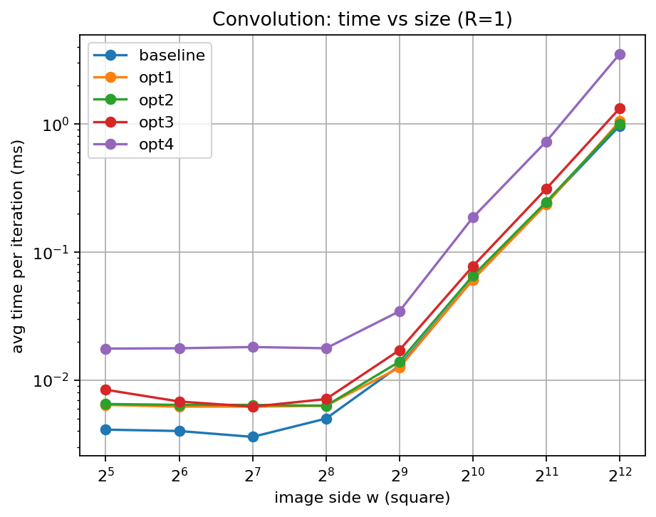
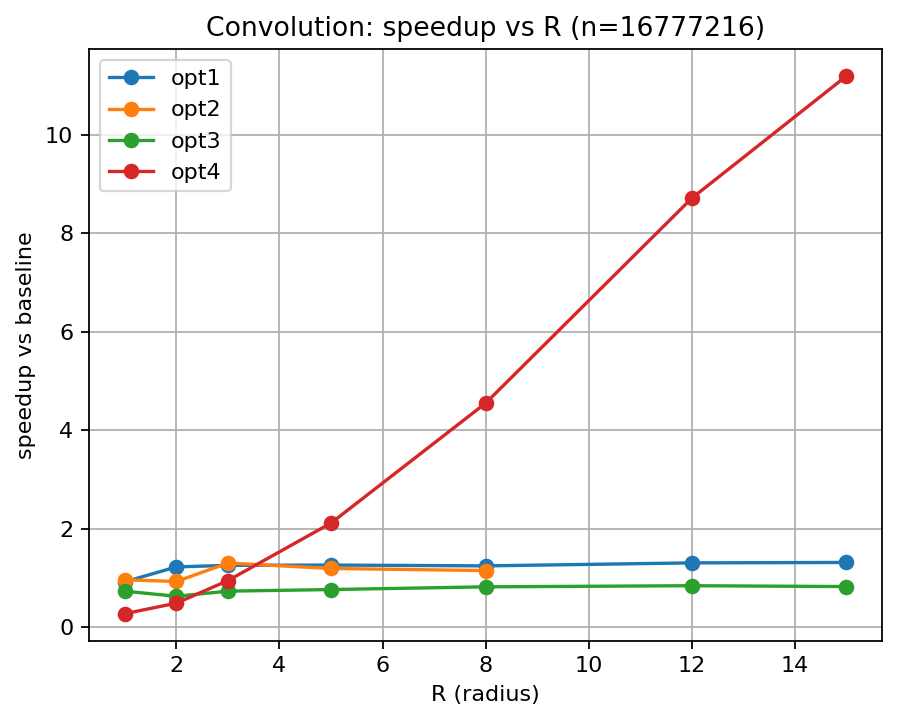

# Convolution Benchmark Results

- Generated from: `/content/gpu-parallel-patterns/benchmarks/results/conv_20260228_102655.csv`

- Git revision: `e6a6f38`

- Environment capture: `/content/gpu-parallel-patterns/benchmarks/results/conv_20260228_102655_env.txt`

## Plots

### Time vs size (R=1)

### Speedup vs R (n=16777216)

## Tables

> Notes:

> - Speedup is computed as `baseline_time / variant_time`.

> - If a row shows `—`, it usually means baseline timing is missing for that (n,R).

### R = 1

**Avg time per iteration (ms)**

| w | baseline | opt1 | opt2 | opt3 | opt4 |
|---|---|---|---|---|---|
| 32 | 0.0041 | 0.0064 | 0.0065 | 0.0084 | 0.0176 |
| 64 | 0.0040 | 0.0062 | 0.0064 | 0.0068 | 0.0177 |
| 128 | 0.0036 | 0.0062 | 0.0064 | 0.0062 | 0.0181 |
| 256 | 0.0050 | 0.0063 | 0.0063 | 0.0071 | 0.0177 |
| 512 | 0.0129 | 0.0125 | 0.0139 | 0.0171 | 0.0344 |
| 1024 | 0.0608 | 0.0607 | 0.0651 | 0.0773 | 0.1856 |
| 2048 | 0.2405 | 0.2357 | 0.2457 | 0.3111 | 0.7277 |
| 4096 | 0.9658 | 1.0469 | 1.0024 | 1.3208 | 3.5078 |

**Speedup vs baseline**

| w | baseline | opt1 | opt2 | opt3 | opt4 |
|---|---|---|---|---|---|
| 32 | 1.00× | 0.64× | 0.63× | 0.49× | 0.23× |
| 64 | 1.00× | 0.65× | 0.62× | 0.59× | 0.23× |
| 128 | 1.00× | 0.58× | 0.56× | 0.58× | 0.20× |
| 256 | 1.00× | 0.79× | 0.79× | 0.70× | 0.28× |
| 512 | 1.00× | 1.03× | 0.93× | 0.75× | 0.38× |
| 1024 | 1.00× | 1.00× | 0.93× | 0.79× | 0.33× |
| 2048 | 1.00× | 1.02× | 0.98× | 0.77× | 0.33× |
| 4096 | 1.00× | 0.92× | 0.96× | 0.73× | 0.28× |

### R = 2

**Avg time per iteration (ms)**

| w | baseline | opt1 | opt2 | opt3 | opt4 |
|---|---|---|---|---|---|
| 32 | 0.0030 | 0.0061 | 0.0064 | 0.0063 | 0.0176 |
| 64 | 0.0031 | 0.0068 | 0.0063 | 0.0065 | 0.0177 |
| 128 | 0.0037 | 0.0063 | 0.0066 | 0.0069 | 0.0176 |
| 256 | 0.0081 | 0.0078 | 0.0098 | 0.0115 | 0.0176 |
| 512 | 0.0249 | 0.0198 | 0.0262 | 0.0328 | 0.0353 |
| 1024 | 0.0940 | 0.0813 | 0.1066 | 0.1312 | 0.1890 |
| 2048 | 0.3819 | 0.3277 | 0.4123 | 0.5689 | 0.7450 |
| 4096 | 1.7859 | 1.4580 | 1.9232 | 2.8404 | 3.6514 |

**Speedup vs baseline**

| w | baseline | opt1 | opt2 | opt3 | opt4 |
|---|---|---|---|---|---|
| 32 | 1.00× | 0.49× | 0.47× | 0.48× | 0.17× |
| 64 | 1.00× | 0.46× | 0.49× | 0.48× | 0.18× |
| 128 | 1.00× | 0.59× | 0.56× | 0.54× | 0.21× |
| 256 | 1.00× | 1.04× | 0.83× | 0.70× | 0.46× |
| 512 | 1.00× | 1.26× | 0.95× | 0.76× | 0.71× |
| 1024 | 1.00× | 1.16× | 0.88× | 0.72× | 0.50× |
| 2048 | 1.00× | 1.17× | 0.93× | 0.67× | 0.51× |
| 4096 | 1.00× | 1.22× | 0.93× | 0.63× | 0.49× |

### R = 3

**Avg time per iteration (ms)**

| w | baseline | opt1 | opt2 | opt3 | opt4 |
|---|---|---|---|---|---|
| 32 | 0.0097 | 0.0095 | 0.0063 | 0.0092 | 0.0280 |
| 64 | 0.0065 | 0.0098 | 0.0064 | 0.0093 | 0.0254 |
| 128 | 0.0070 | 0.0092 | 0.0064 | 0.0097 | 0.0320 |
| 256 | 0.0150 | 0.0130 | 0.0114 | 0.0182 | 0.0252 |
| 512 | 0.0509 | 0.0388 | 0.0324 | 0.0559 | 0.0382 |
| 1024 | 0.1793 | 0.1573 | 0.1312 | 0.2482 | 0.1951 |
| 2048 | 0.7477 | 0.6011 | 0.5229 | 1.0977 | 0.8383 |
| 4096 | 3.6587 | 2.9124 | 2.8075 | 4.9955 | 3.8616 |

**Speedup vs baseline**

| w | baseline | opt1 | opt2 | opt3 | opt4 |
|---|---|---|---|---|---|
| 32 | 1.00× | 1.02× | 1.54× | 1.05× | 0.35× |
| 64 | 1.00× | 0.66× | 1.02× | 0.70× | 0.26× |
| 128 | 1.00× | 0.76× | 1.09× | 0.72× | 0.22× |
| 256 | 1.00× | 1.15× | 1.32× | 0.82× | 0.60× |
| 512 | 1.00× | 1.31× | 1.57× | 0.91× | 1.33× |
| 1024 | 1.00× | 1.14× | 1.37× | 0.72× | 0.92× |
| 2048 | 1.00× | 1.24× | 1.43× | 0.68× | 0.89× |
| 4096 | 1.00× | 1.26× | 1.30× | 0.73× | 0.95× |

### R = 5

**Avg time per iteration (ms)**

| w | baseline | opt1 | opt2 | opt3 | opt4 |
|---|---|---|---|---|---|
| 32 | 0.0077 | 0.0084 | 0.0101 | 0.0153 | 0.0177 |
| 64 | 0.0081 | 0.0086 | 0.0094 | 0.0156 | 0.0185 |
| 128 | 0.0111 | 0.0097 | 0.0104 | 0.0169 | 0.0185 |
| 256 | 0.0311 | 0.0216 | 0.0255 | 0.0358 | 0.0182 |
| 512 | 0.1100 | 0.0727 | 0.0863 | 0.1184 | 0.0395 |
| 1024 | 0.4379 | 0.2758 | 0.3785 | 0.4955 | 0.2032 |
| 2048 | 1.9462 | 1.3059 | 1.6426 | 2.5029 | 0.8182 |
| 4096 | 8.5229 | 6.7511 | 7.1455 | 11.1392 | 4.0305 |

**Speedup vs baseline**

| w | baseline | opt1 | opt2 | opt3 | opt4 |
|---|---|---|---|---|---|
| 32 | 1.00× | 0.92× | 0.76× | 0.50× | 0.44× |
| 64 | 1.00× | 0.94× | 0.86× | 0.52× | 0.44× |
| 128 | 1.00× | 1.14× | 1.07× | 0.66× | 0.60× |
| 256 | 1.00× | 1.44× | 1.22× | 0.87× | 1.71× |
| 512 | 1.00× | 1.51× | 1.27× | 0.93× | 2.78× |
| 1024 | 1.00× | 1.59× | 1.16× | 0.88× | 2.16× |
| 2048 | 1.00× | 1.49× | 1.18× | 0.78× | 2.38× |
| 4096 | 1.00× | 1.26× | 1.19× | 0.77× | 2.11× |

### R = 8

**Avg time per iteration (ms)**

| w | baseline | opt1 | opt2 | opt3 | opt4 |
|---|---|---|---|---|---|
| 32 | 0.0146 | 0.0135 | 0.0111 | 0.0303 | 0.0180 |
| 64 | 0.0149 | 0.0138 | 0.0109 | 0.0304 | 0.0179 |
| 128 | 0.0210 | 0.0171 | 0.0186 | 0.0334 | 0.0181 |
| 256 | 0.0656 | 0.0459 | 0.0568 | 0.0760 | 0.0279 |
| 512 | 0.2495 | 0.1659 | 0.2031 | 0.2634 | 0.0453 |
| 1024 | 1.0631 | 0.6980 | 0.8681 | 1.2372 | 0.2169 |
| 2048 | 4.8042 | 3.4881 | 3.9836 | 5.8283 | 0.8527 |
| 4096 | 18.9713 | 15.2307 | 16.4873 | 23.1342 | 4.1711 |

**Speedup vs baseline**

| w | baseline | opt1 | opt2 | opt3 | opt4 |
|---|---|---|---|---|---|
| 32 | 1.00× | 1.08× | 1.32× | 0.48× | 0.81× |
| 64 | 1.00× | 1.08× | 1.37× | 0.49× | 0.83× |
| 128 | 1.00× | 1.23× | 1.13× | 0.63× | 1.16× |
| 256 | 1.00× | 1.43× | 1.15× | 0.86× | 2.35× |
| 512 | 1.00× | 1.50× | 1.23× | 0.95× | 5.51× |
| 1024 | 1.00× | 1.52× | 1.22× | 0.86× | 4.90× |
| 2048 | 1.00× | 1.38× | 1.21× | 0.82× | 5.63× |
| 4096 | 1.00× | 1.25× | 1.15× | 0.82× | 4.55× |

### R = 12

**Avg time per iteration (ms)**

| w | baseline | opt1 | opt3 | opt4 |
|---|---|---|---|---|
| 32 | 0.0273 | 0.0272 | 0.0701 | 0.0185 |
| 64 | 0.0280 | 0.0277 | 0.0701 | 0.0186 |
| 128 | 0.0436 | 0.0344 | 0.0710 | 0.0181 |
| 256 | 0.1372 | 0.0956 | 0.1638 | 0.0210 |
| 512 | 0.5266 | 0.3548 | 0.5740 | 0.0555 |
| 1024 | 2.4077 | 1.5598 | 2.7682 | 0.2401 |
| 2048 | 10.1779 | 8.0422 | 12.4240 | 0.9435 |
| 4096 | 40.7406 | 31.1890 | 48.3257 | 4.6785 |

**Speedup vs baseline**

| w | baseline | opt1 | opt3 | opt4 |
|---|---|---|---|---|
| 32 | 1.00× | 1.00× | 0.39× | 1.48× |
| 64 | 1.00× | 1.01× | 0.40× | 1.51× |
| 128 | 1.00× | 1.27× | 0.61× | 2.41× |
| 256 | 1.00× | 1.44× | 0.84× | 6.53× |
| 512 | 1.00× | 1.48× | 0.92× | 9.49× |
| 1024 | 1.00× | 1.54× | 0.87× | 10.03× |
| 2048 | 1.00× | 1.27× | 0.82× | 10.79× |
| 4096 | 1.00× | 1.31× | 0.84× | 8.71× |

### R = 15

**Avg time per iteration (ms)**

| w | baseline | opt1 | opt3 | opt4 |
|---|---|---|---|---|
| 32 | 0.0408 | 0.0375 | 0.0902 | 0.0175 |
| 64 | 0.0423 | 0.0377 | 0.0903 | 0.0193 |
| 128 | 0.0650 | 0.0488 | 0.0995 | 0.0280 |
| 256 | 0.2189 | 0.1444 | 0.2443 | 0.0268 |
| 512 | 0.8481 | 0.6133 | 0.9583 | 0.0580 |
| 1024 | 3.7687 | 2.7201 | 4.5333 | 0.2544 |
| 2048 | 15.2501 | 11.8012 | 18.6634 | 1.0008 |
| 4096 | 61.9612 | 47.1083 | 75.0377 | 5.5382 |

**Speedup vs baseline**

| w | baseline | opt1 | opt3 | opt4 |
|---|---|---|---|---|
| 32 | 1.00× | 1.09× | 0.45× | 2.33× |
| 64 | 1.00× | 1.12× | 0.47× | 2.19× |
| 128 | 1.00× | 1.33× | 0.65× | 2.32× |
| 256 | 1.00× | 1.52× | 0.90× | 8.17× |
| 512 | 1.00× | 1.38× | 0.89× | 14.62× |
| 1024 | 1.00× | 1.39× | 0.83× | 14.81× |
| 2048 | 1.00× | 1.29× | 0.82× | 15.24× |
| 4096 | 1.00× | 1.32× | 0.83× | 11.19× |
