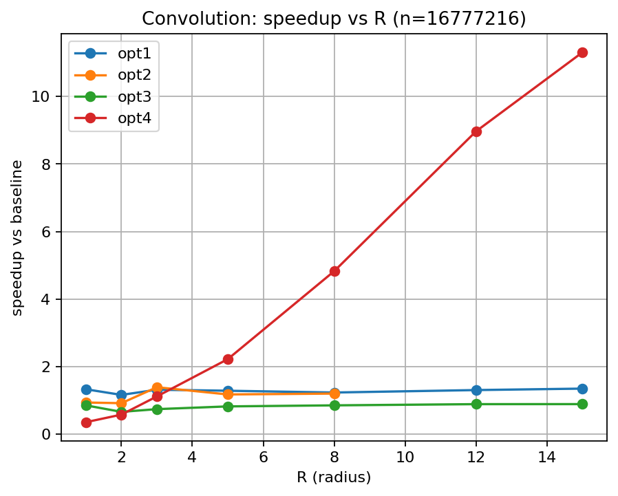

# Convolution Benchmark Results

- Generated from: `/content/gpu-parallel-patterns/benchmarks/results/conv_20260307_213559.csv`

- Git revision: `06db29a`

- Environment capture: `/content/gpu-parallel-patterns/benchmarks/results/conv_20260307_213559_env.txt`

## Plots

### Time vs size (R=1)

### Speedup vs R (n=16777216)

## Tables

> Notes:

> - `cpu_ref` is the single-threaded CPU reference (not a GPU variant).

> - Speedup is computed as `baseline_time / variant_time`.

> - If a row shows `—`, it usually means baseline timing is missing for that (n,R).

### R = 1

**Avg time per iteration (ms)**

| w | cpu_ref | baseline | opt1 | opt2 | opt3 | opt4 |
|---|---|---|---|---|---|---|
| 32 | 0.0247 | 0.0051 | 0.0063 | 0.0068 | 0.0092 | 0.0175 |
| 64 | 0.0987 | 0.0043 | 0.0064 | 0.0064 | 0.0067 | 0.0178 |
| 128 | 0.3992 | 0.0038 | 0.0065 | 0.0065 | 0.0064 | 0.0179 |
| 256 | 1.5480 | 0.0064 | 0.0064 | 0.0066 | 0.0072 | 0.0177 |
| 512 | 6.2700 | 0.0162 | 0.0137 | 0.0176 | 0.0221 | 0.0419 |
| 1024 | 25.0910 | 0.0749 | 0.0617 | 0.0807 | 0.0979 | 0.2072 |
| 2048 | 100.6610 | 0.3298 | 0.2391 | 0.3172 | 0.4139 | 0.8193 |
| 4096 | 414.1280 | 1.3277 | 1.0019 | 1.4239 | 1.5666 | 3.7934 |
| 8192 | 1627.7791 | 6.3350 | 6.0165 | 6.0791 | 7.8039 | 15.6677 |
| 16384 | 7790.5601 | 23.6244 | 21.5343 | 21.9303 | 28.1675 | 65.5704 |

**Speedup vs baseline**

| w | baseline | opt1 | opt2 | opt3 | opt4 |
|---|---|---|---|---|---|
| 32 | 1.00× | 0.81× | 0.75× | 0.55× | 0.29× |
| 64 | 1.00× | 0.67× | 0.67× | 0.64× | 0.24× |
| 128 | 1.00× | 0.58× | 0.58× | 0.59× | 0.21× |
| 256 | 1.00× | 1.00× | 0.97× | 0.89× | 0.36× |
| 512 | 1.00× | 1.18× | 0.92× | 0.73× | 0.39× |
| 1024 | 1.00× | 1.21× | 0.93× | 0.77× | 0.36× |
| 2048 | 1.00× | 1.38× | 1.04× | 0.80× | 0.40× |
| 4096 | 1.00× | 1.33× | 0.93× | 0.85× | 0.35× |
| 8192 | 1.00× | 1.05× | 1.04× | 0.81× | 0.40× |
| 16384 | 1.00× | 1.10× | 1.08× | 0.84× | 0.36× |

### R = 2

**Avg time per iteration (ms)**

| w | cpu_ref | baseline | opt1 | opt2 | opt3 | opt4 |
|---|---|---|---|---|---|---|
| 32 | 0.1052 | 0.0030 | 0.0064 | 0.0065 | 0.0098 | 0.0193 |
| 64 | 0.2434 | 0.0031 | 0.0064 | 0.0098 | 0.0066 | 0.0176 |
| 128 | 1.4940 | 0.0037 | 0.0062 | 0.0092 | 0.0091 | 0.0179 |
| 256 | 3.9870 | 0.0078 | 0.0076 | 0.0096 | 0.0114 | 0.0175 |
| 512 | 16.1090 | 0.0263 | 0.0232 | 0.0332 | 0.0392 | 0.0408 |
| 1024 | 63.8940 | 0.1043 | 0.0953 | 0.1354 | 0.1652 | 0.2082 |
| 2048 | 270.7260 | 0.3928 | 0.4178 | 0.5751 | 0.7349 | 0.8459 |
| 4096 | 1038.4600 | 2.2154 | 1.9127 | 2.4274 | 3.3772 | 3.8595 |
| 8192 | 4901.8740 | 11.8301 | 8.8484 | 10.3891 | 13.4463 | 15.9545 |
| 16384 | 19366.5684 | 47.2741 | 36.3284 | 41.8523 | 53.7879 | 67.4119 |

**Speedup vs baseline**

| w | baseline | opt1 | opt2 | opt3 | opt4 |
|---|---|---|---|---|---|
| 32 | 1.00× | 0.47× | 0.46× | 0.31× | 0.16× |
| 64 | 1.00× | 0.48× | 0.32× | 0.47× | 0.18× |
| 128 | 1.00× | 0.60× | 0.40× | 0.41× | 0.21× |
| 256 | 1.00× | 1.03× | 0.81× | 0.68× | 0.45× |
| 512 | 1.00× | 1.13× | 0.79× | 0.67× | 0.64× |
| 1024 | 1.00× | 1.09× | 0.77× | 0.63× | 0.50× |
| 2048 | 1.00× | 0.94× | 0.68× | 0.53× | 0.46× |
| 4096 | 1.00× | 1.16× | 0.91× | 0.66× | 0.57× |
| 8192 | 1.00× | 1.34× | 1.14× | 0.88× | 0.74× |
| 16384 | 1.00× | 1.30× | 1.13× | 0.88× | 0.70× |

### R = 3

**Avg time per iteration (ms)**

| w | cpu_ref | baseline | opt1 | opt2 | opt3 | opt4 |
|---|---|---|---|---|---|---|
| 32 | 0.1149 | 0.0046 | 0.0065 | 0.0062 | 0.0088 | 0.0179 |
| 64 | 0.4865 | 0.0047 | 0.0064 | 0.0065 | 0.0098 | 0.0191 |
| 128 | 1.9240 | 0.0056 | 0.0065 | 0.0088 | 0.0097 | 0.0197 |
| 256 | 8.0660 | 0.0131 | 0.0114 | 0.0113 | 0.0183 | 0.0193 |
| 512 | 30.1450 | 0.0527 | 0.0365 | 0.0356 | 0.0678 | 0.0515 |
| 1024 | 121.5620 | 0.2144 | 0.1359 | 0.1352 | 0.2759 | 0.2366 |
| 2048 | 483.0740 | 0.9688 | 0.5688 | 0.5120 | 1.3015 | 0.8611 |
| 4096 | 1996.6801 | 4.4118 | 3.3640 | 3.1848 | 5.9927 | 3.9644 |
| 8192 | 9162.6475 | 18.5098 | 14.5451 | 14.1125 | 22.6034 | 17.0882 |
| 16384 | 34523.3047 | 72.4689 | 59.3119 | 55.9124 | 91.4324 | 72.4234 |

**Speedup vs baseline**

| w | baseline | opt1 | opt2 | opt3 | opt4 |
|---|---|---|---|---|---|
| 32 | 1.00× | 0.71× | 0.74× | 0.52× | 0.26× |
| 64 | 1.00× | 0.73× | 0.72× | 0.48× | 0.25× |
| 128 | 1.00× | 0.86× | 0.64× | 0.58× | 0.28× |
| 256 | 1.00× | 1.15× | 1.16× | 0.72× | 0.68× |
| 512 | 1.00× | 1.44× | 1.48× | 0.78× | 1.02× |
| 1024 | 1.00× | 1.58× | 1.59× | 0.78× | 0.91× |
| 2048 | 1.00× | 1.70× | 1.89× | 0.74× | 1.13× |
| 4096 | 1.00× | 1.31× | 1.39× | 0.74× | 1.11× |
| 8192 | 1.00× | 1.27× | 1.31× | 0.82× | 1.08× |
| 16384 | 1.00× | 1.22× | 1.30× | 0.79× | 1.00× |

### R = 5

**Avg time per iteration (ms)**

| w | cpu_ref | baseline | opt1 | opt2 | opt3 | opt4 |
|---|---|---|---|---|---|---|
| 32 | 0.5529 | 0.0077 | 0.0084 | 0.0065 | 0.0153 | 0.0176 |
| 64 | 2.4115 | 0.0078 | 0.0085 | 0.0064 | 0.0157 | 0.0180 |
| 128 | 9.8410 | 0.0108 | 0.0098 | 0.0095 | 0.0170 | 0.0183 |
| 256 | 35.8930 | 0.0302 | 0.0218 | 0.0256 | 0.0359 | 0.0183 |
| 512 | 88.8410 | 0.1377 | 0.0821 | 0.0943 | 0.1556 | 0.0476 |
| 1024 | 313.3640 | 0.5612 | 0.3283 | 0.3868 | 0.6666 | 0.2321 |
| 2048 | 1224.9830 | 2.5099 | 1.3933 | 1.7279 | 2.8876 | 0.9212 |
| 4096 | 6184.7642 | 9.6816 | 7.5545 | 8.2641 | 11.8447 | 4.3645 |
| 8192 | 22360.9395 | 39.3845 | 30.6405 | 33.5349 | 48.0266 | 18.5429 |
| 16384 | 88201.8984 | 157.0583 | 125.1853 | 135.3777 | 193.7442 | 77.9402 |

**Speedup vs baseline**

| w | baseline | opt1 | opt2 | opt3 | opt4 |
|---|---|---|---|---|---|
| 32 | 1.00× | 0.92× | 1.18× | 0.50× | 0.44× |
| 64 | 1.00× | 0.92× | 1.22× | 0.50× | 0.43× |
| 128 | 1.00× | 1.10× | 1.14× | 0.64× | 0.59× |
| 256 | 1.00× | 1.39× | 1.18× | 0.84× | 1.65× |
| 512 | 1.00× | 1.68× | 1.46× | 0.88× | 2.89× |
| 1024 | 1.00× | 1.71× | 1.45× | 0.84× | 2.42× |
| 2048 | 1.00× | 1.80× | 1.45× | 0.87× | 2.72× |
| 4096 | 1.00× | 1.28× | 1.17× | 0.82× | 2.22× |
| 8192 | 1.00× | 1.29× | 1.17× | 0.82× | 2.12× |
| 16384 | 1.00× | 1.25× | 1.16× | 0.81× | 2.02× |

### R = 8

**Avg time per iteration (ms)**

| w | cpu_ref | baseline | opt1 | opt2 | opt3 | opt4 |
|---|---|---|---|---|---|---|
| 32 | 0.5777 | 0.0139 | 0.0135 | 0.0111 | 0.0301 | 0.0181 |
| 64 | 2.5040 | 0.0142 | 0.0138 | 0.0110 | 0.0305 | 0.0177 |
| 128 | 10.3900 | 0.0208 | 0.0173 | 0.0187 | 0.0334 | 0.0186 |
| 256 | 45.4420 | 0.0644 | 0.0463 | 0.0573 | 0.0754 | 0.0268 |
| 512 | 175.3330 | 0.3361 | 0.1878 | 0.2595 | 0.3282 | 0.0448 |
| 1024 | 1279.2090 | 1.3320 | 0.8159 | 1.0734 | 1.4456 | 0.2520 |
| 2048 | 2851.5911 | 5.7082 | 4.0784 | 4.6637 | 6.2942 | 0.9836 |
| 4096 | 12717.1826 | 21.5956 | 17.5718 | 18.0377 | 25.4541 | 4.4753 |
| 8192 | 51100.8789 | 87.6974 | 69.7558 | 73.1584 | 102.0734 | 19.9524 |
| 16384 | 209622.5156 | 352.1221 | 278.4578 | 285.2526 | 398.8841 | 83.1175 |

**Speedup vs baseline**

| w | baseline | opt1 | opt2 | opt3 | opt4 |
|---|---|---|---|---|---|
| 32 | 1.00× | 1.03× | 1.25× | 0.46× | 0.77× |
| 64 | 1.00× | 1.03× | 1.29× | 0.47× | 0.80× |
| 128 | 1.00× | 1.20× | 1.11× | 0.62× | 1.12× |
| 256 | 1.00× | 1.39× | 1.12× | 0.85× | 2.40× |
| 512 | 1.00× | 1.79× | 1.30× | 1.02× | 7.50× |
| 1024 | 1.00× | 1.63× | 1.24× | 0.92× | 5.29× |
| 2048 | 1.00× | 1.40× | 1.22× | 0.91× | 5.80× |
| 4096 | 1.00× | 1.23× | 1.20× | 0.85× | 4.83× |
| 8192 | 1.00× | 1.26× | 1.20× | 0.86× | 4.40× |
| 16384 | 1.00× | 1.26× | 1.23× | 0.88× | 4.24× |

### R = 12

**Avg time per iteration (ms)**

| w | cpu_ref | baseline | opt1 | opt3 | opt4 |
|---|---|---|---|---|---|
| 32 | 1.1340 | 0.0294 | 0.0274 | 0.0612 | 0.0180 |
| 64 | 5.2820 | 0.0302 | 0.0279 | 0.0616 | 0.0181 |
| 128 | 21.6690 | 0.0469 | 0.0348 | 0.0678 | 0.0184 |
| 256 | 91.9890 | 0.1483 | 0.0965 | 0.1559 | 0.0205 |
| 512 | 371.9640 | 0.6767 | 0.4648 | 0.6518 | 0.0597 |
| 1024 | 1645.7180 | 2.9546 | 1.9921 | 2.9622 | 0.2482 |
| 2048 | 6076.8569 | 11.4119 | 8.5854 | 13.1506 | 0.9687 |
| 4096 | 27129.9395 | 45.3749 | 34.8661 | 51.3325 | 5.0586 |
| 8192 | 110585.0078 | 184.8181 | 139.8581 | 206.3509 | 24.3234 |
| 16384 | 444546.2188 | 741.7517 | 553.2416 | 819.8126 | 99.4621 |

**Speedup vs baseline**

| w | baseline | opt1 | opt3 | opt4 |
|---|---|---|---|---|
| 32 | 1.00× | 1.07× | 0.48× | 1.63× |
| 64 | 1.00× | 1.08× | 0.49× | 1.67× |
| 128 | 1.00× | 1.35× | 0.69× | 2.55× |
| 256 | 1.00× | 1.54× | 0.95× | 7.23× |
| 512 | 1.00× | 1.46× | 1.04× | 11.34× |
| 1024 | 1.00× | 1.48× | 1.00× | 11.90× |
| 2048 | 1.00× | 1.33× | 0.87× | 11.78× |
| 4096 | 1.00× | 1.30× | 0.88× | 8.97× |
| 8192 | 1.00× | 1.32× | 0.90× | 7.60× |
| 16384 | 1.00× | 1.34× | 0.90× | 7.46× |

### R = 15

**Avg time per iteration (ms)**

| w | cpu_ref | baseline | opt1 | opt3 | opt4 |
|---|---|---|---|---|---|
| 32 | 1.5660 | 0.0396 | 0.0374 | 0.0900 | 0.0183 |
| 64 | 7.6360 | 0.0407 | 0.0377 | 0.0903 | 0.0185 |
| 128 | 33.3160 | 0.0627 | 0.0489 | 0.0995 | 0.0179 |
| 256 | 152.8010 | 0.2137 | 0.1436 | 0.2448 | 0.0221 |
| 512 | 580.2020 | 1.0322 | 0.7714 | 1.1038 | 0.0768 |
| 1024 | 3577.0630 | 4.3118 | 3.2575 | 4.7744 | 0.3244 |
| 2048 | 10567.4072 | 17.5421 | 14.2242 | 19.4736 | 1.1462 |
| 4096 | 41262.4258 | 69.4802 | 51.6733 | 78.4957 | 6.1430 |
| 8192 | 166687.1250 | 278.3351 | 207.3696 | 322.5176 | 27.0296 |
| 16384 | 674401.3750 | 1106.2156 | 826.1125 | 1320.9800 | 108.9688 |

**Speedup vs baseline**

| w | baseline | opt1 | opt3 | opt4 |
|---|---|---|---|---|
| 32 | 1.00× | 1.06× | 0.44× | 2.16× |
| 64 | 1.00× | 1.08× | 0.45× | 2.20× |
| 128 | 1.00× | 1.28× | 0.63× | 3.50× |
| 256 | 1.00× | 1.49× | 0.87× | 9.67× |
| 512 | 1.00× | 1.34× | 0.94× | 13.44× |
| 1024 | 1.00× | 1.32× | 0.90× | 13.29× |
| 2048 | 1.00× | 1.23× | 0.90× | 15.30× |
| 4096 | 1.00× | 1.34× | 0.89× | 11.31× |
| 8192 | 1.00× | 1.34× | 0.86× | 10.30× |
| 16384 | 1.00× | 1.34× | 0.84× | 10.15× |
