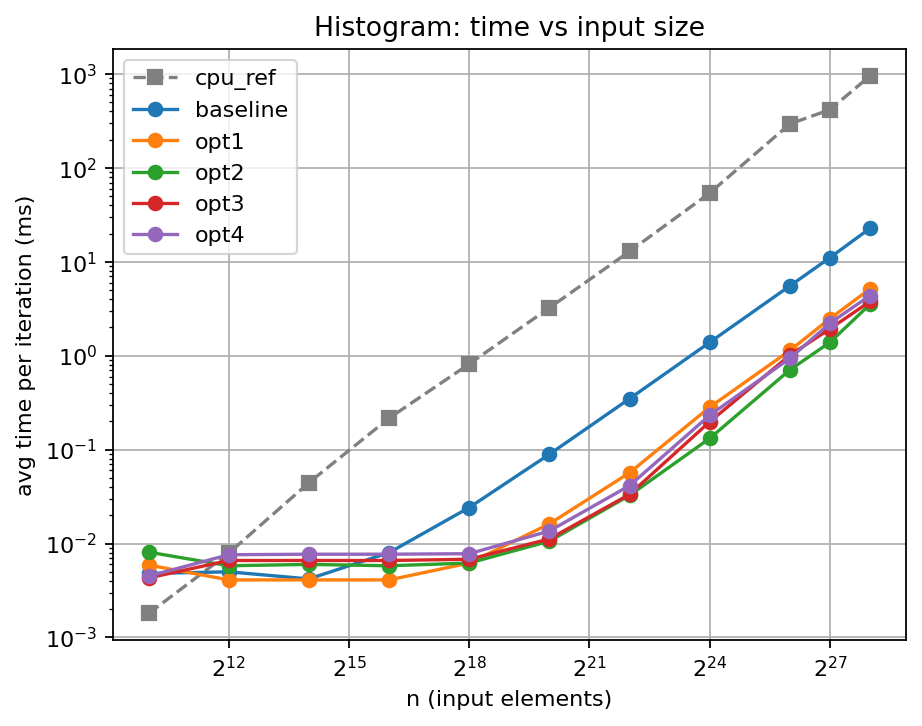
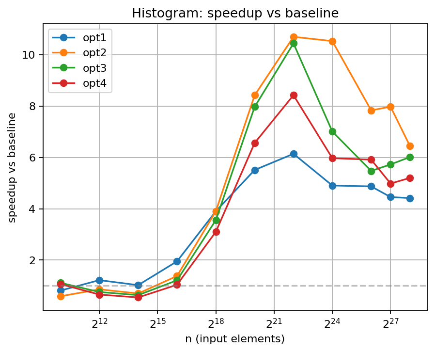

# Histogram Benchmark Results

- Generated from: `/content/gpu-parallel-patterns/benchmarks/results/hist_20260309_214236.csv`

- Git revision: `1eb83f1`

- Environment capture: `/content/gpu-parallel-patterns/benchmarks/results/hist_20260309_214236_env.txt`

## Plots

### Time vs input size

### Speedup vs baseline

## Tables

> Notes:

> - `cpu_ref` is the single-threaded CPU reference (not a GPU variant).

> - Speedup is computed as `baseline_time / variant_time`.

> - If a row shows `—`, it usually means baseline timing is missing for that size.

**Avg time per iteration (ms)**

| n | cpu_ref | baseline | opt1 | opt2 | opt3 | opt4 |
|---|---|---|---|---|---|---|
| 1024 | 0.0018 | 0.0048 | 0.0059 | 0.0081 | 0.0043 | 0.0045 |
| 4096 | 0.0079 | 0.0050 | 0.0041 | 0.0058 | 0.0066 | 0.0076 |
| 16384 | 0.0445 | 0.0042 | 0.0041 | 0.0060 | 0.0066 | 0.0077 |
| 65536 | 0.2165 | 0.0080 | 0.0041 | 0.0058 | 0.0066 | 0.0077 |
| 262144 | 0.8178 | 0.0242 | 0.0062 | 0.0062 | 0.0068 | 0.0078 |
| 1048576 | 3.2428 | 0.0893 | 0.0162 | 0.0106 | 0.0112 | 0.0136 |
| 4194304 | 12.9273 | 0.3489 | 0.0568 | 0.0326 | 0.0334 | 0.0414 |
| 16777216 | 54.1144 | 1.3896 | 0.2832 | 0.1319 | 0.1982 | 0.2327 |
| 67108864 | 294.5610 | 5.5485 | 1.1386 | 0.7081 | 1.0133 | 0.9379 |
| 134217728 | 417.9670 | 11.0923 | 2.4882 | 1.3903 | 1.9364 | 2.2257 |
| 268435456 | 956.9070 | 22.7873 | 5.1592 | 3.5369 | 3.7874 | 4.3790 |

**Speedup vs baseline**

| n | baseline | opt1 | opt2 | opt3 | opt4 |
|---|---|---|---|---|---|
| 1024 | 1.00x | 0.81x | 0.59x | 1.12x | 1.07x |
| 4096 | 1.00x | 1.22x | 0.86x | 0.76x | 0.66x |
| 16384 | 1.00x | 1.02x | 0.70x | 0.64x | 0.55x |
| 65536 | 1.00x | 1.95x | 1.38x | 1.21x | 1.04x |
| 262144 | 1.00x | 3.90x | 3.90x | 3.56x | 3.10x |
| 1048576 | 1.00x | 5.51x | 8.42x | 7.97x | 6.57x |
| 4194304 | 1.00x | 6.14x | 10.70x | 10.45x | 8.43x |
| 16777216 | 1.00x | 4.91x | 10.54x | 7.01x | 5.97x |
| 67108864 | 1.00x | 4.87x | 7.84x | 5.48x | 5.92x |
| 134217728 | 1.00x | 4.46x | 7.98x | 5.73x | 4.98x |
| 268435456 | 1.00x | 4.42x | 6.44x | 6.02x | 5.20x |
