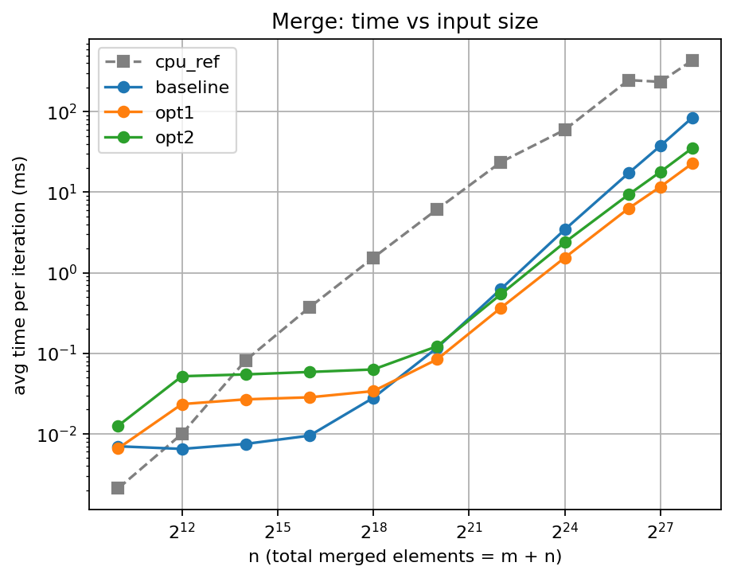
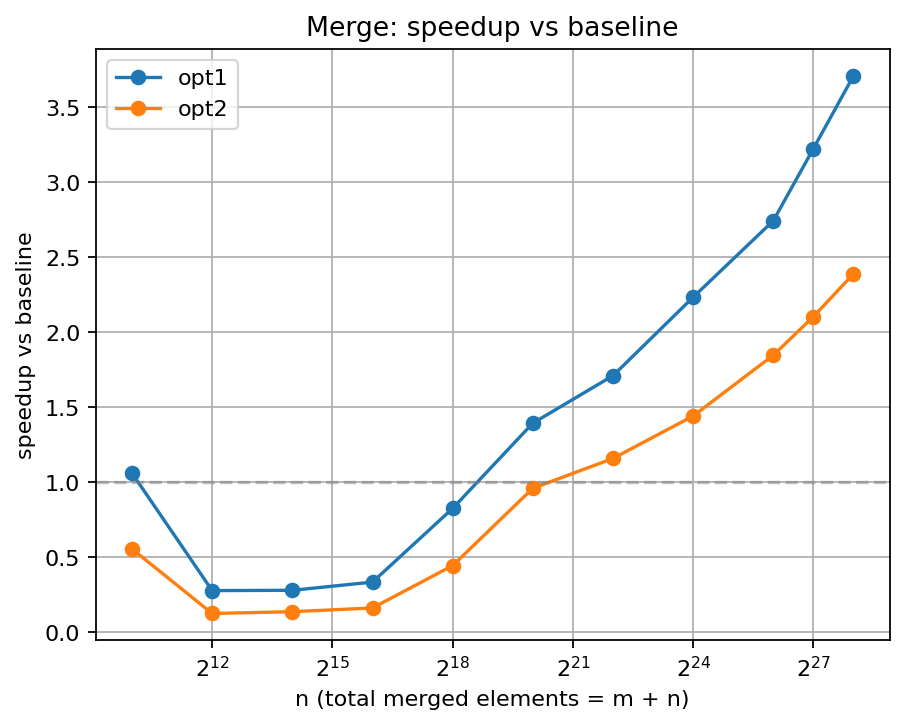

# Merge Benchmark Results

- Generated from: `/content/gpu-parallel-patterns/benchmarks/results/merge_20260329_144537.csv`

- Git revision: `e7a4f79`

- Environment capture: `/content/gpu-parallel-patterns/benchmarks/results/merge_20260329_144537_env.txt`

## Plots

### Time vs input size

### Speedup vs baseline

## Tables

> Notes:

> - `cpu_ref` is the single-threaded CPU reference (not a GPU variant).

> - Speedup is computed as `baseline_time / variant_time`.

> - If a row shows `—`, it usually means baseline timing is missing for that size.

**Avg time per iteration (ms)**

| n | cpu_ref | baseline | opt1 | opt2 |
|---|---|---|---|---|
| 1024 | 0.0021 | 0.0070 | 0.0066 | 0.0126 |
| 4096 | 0.0100 | 0.0065 | 0.0234 | 0.0519 |
| 16384 | 0.0819 | 0.0075 | 0.0268 | 0.0547 |
| 65536 | 0.3725 | 0.0095 | 0.0284 | 0.0586 |
| 262144 | 1.5379 | 0.0280 | 0.0339 | 0.0630 |
| 1048576 | 6.1393 | 0.1174 | 0.0842 | 0.1223 |
| 4194304 | 23.6774 | 0.6284 | 0.3673 | 0.5422 |
| 16777216 | 59.5658 | 3.4366 | 1.5383 | 2.3832 |
| 67108864 | 246.5420 | 17.2585 | 6.2900 | 9.3422 |
| 134217728 | 235.0760 | 37.7069 | 11.6923 | 17.9193 |
| 268435456 | 433.1660 | 84.4732 | 22.7703 | 35.3496 |

**Speedup vs baseline**

| n | baseline | opt1 | opt2 |
|---|---|---|---|
| 1024 | 1.00x | 1.06x | 0.56x |
| 4096 | 1.00x | 0.28x | 0.13x |
| 16384 | 1.00x | 0.28x | 0.14x |
| 65536 | 1.00x | 0.33x | 0.16x |
| 262144 | 1.00x | 0.83x | 0.44x |
| 1048576 | 1.00x | 1.39x | 0.96x |
| 4194304 | 1.00x | 1.71x | 1.16x |
| 16777216 | 1.00x | 2.23x | 1.44x |
| 67108864 | 1.00x | 2.74x | 1.85x |
| 134217728 | 1.00x | 3.22x | 2.10x |
| 268435456 | 1.00x | 3.71x | 2.39x |
