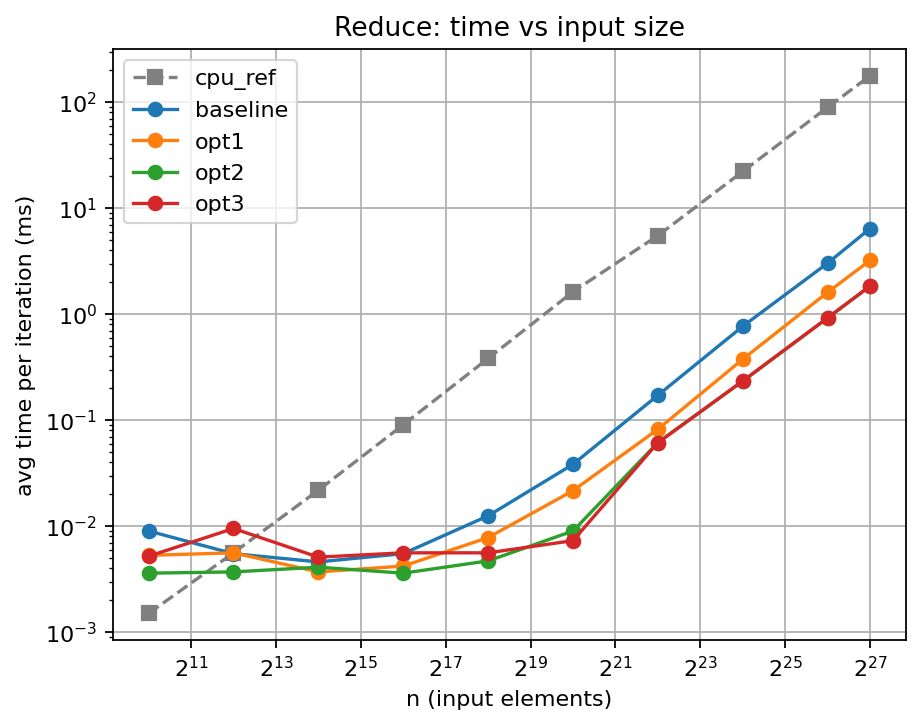
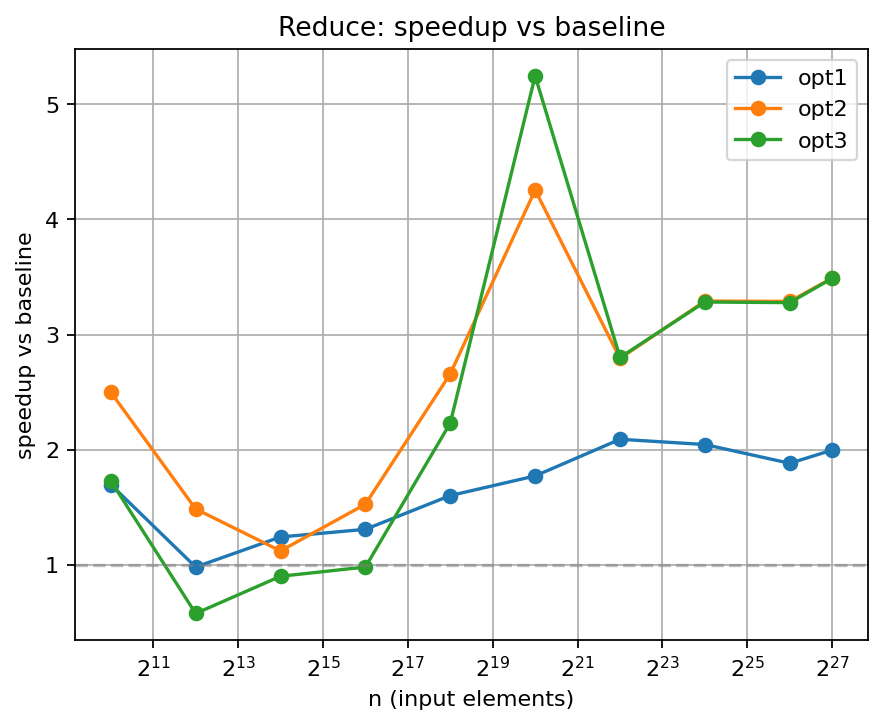

# Reduce Benchmark Results

- Generated from: `/content/gpu-parallel-patterns/benchmarks/results/reduce_20260312_103704.csv`

- Git revision: `9b6e020`

- Environment capture: `/content/gpu-parallel-patterns/benchmarks/results/reduce_20260312_103704_env.txt`

## Plots

### Time vs input size

### Speedup vs baseline

## Tables

> Notes:

> - `cpu_ref` is the single-threaded CPU reference (not a GPU variant).

> - Speedup is computed as `baseline_time / variant_time`.

> - If a row shows `—`, it usually means baseline timing is missing for that size.

**Avg time per iteration (ms)**

| n | cpu_ref | baseline | opt1 | opt2 | opt3 |
|---|---|---|---|---|---|
| 1024 | 0.0015 | 0.0090 | 0.0053 | 0.0036 | 0.0052 |
| 4096 | 0.0056 | 0.0055 | 0.0056 | 0.0037 | 0.0095 |
| 16384 | 0.0218 | 0.0046 | 0.0037 | 0.0041 | 0.0051 |
| 65536 | 0.0904 | 0.0055 | 0.0042 | 0.0036 | 0.0056 |
| 262144 | 0.3819 | 0.0125 | 0.0078 | 0.0047 | 0.0056 |
| 1048576 | 1.6258 | 0.0383 | 0.0216 | 0.0090 | 0.0073 |
| 4194304 | 5.5034 | 0.1715 | 0.0820 | 0.0614 | 0.0612 |
| 16777216 | 22.1588 | 0.7676 | 0.3752 | 0.2332 | 0.2338 |
| 67108864 | 89.3340 | 3.0245 | 1.6063 | 0.9197 | 0.9227 |
| 134217728 | 176.8130 | 6.4155 | 3.2116 | 1.8375 | 1.8391 |

**Speedup vs baseline**

| n | baseline | opt1 | opt2 | opt3 |
|---|---|---|---|---|
| 1024 | 1.00x | 1.70x | 2.50x | 1.73x |
| 4096 | 1.00x | 0.98x | 1.49x | 0.58x |
| 16384 | 1.00x | 1.24x | 1.12x | 0.90x |
| 65536 | 1.00x | 1.31x | 1.53x | 0.98x |
| 262144 | 1.00x | 1.60x | 2.66x | 2.23x |
| 1048576 | 1.00x | 1.77x | 4.26x | 5.25x |
| 4194304 | 1.00x | 2.09x | 2.79x | 2.80x |
| 16777216 | 1.00x | 2.05x | 3.29x | 3.28x |
| 67108864 | 1.00x | 1.88x | 3.29x | 3.28x |
| 134217728 | 1.00x | 2.00x | 3.49x | 3.49x |
