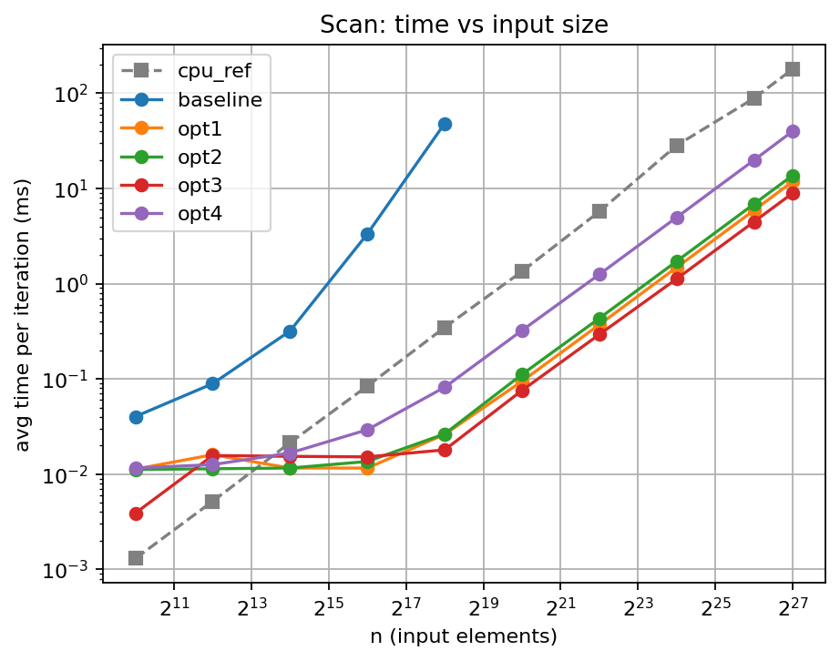
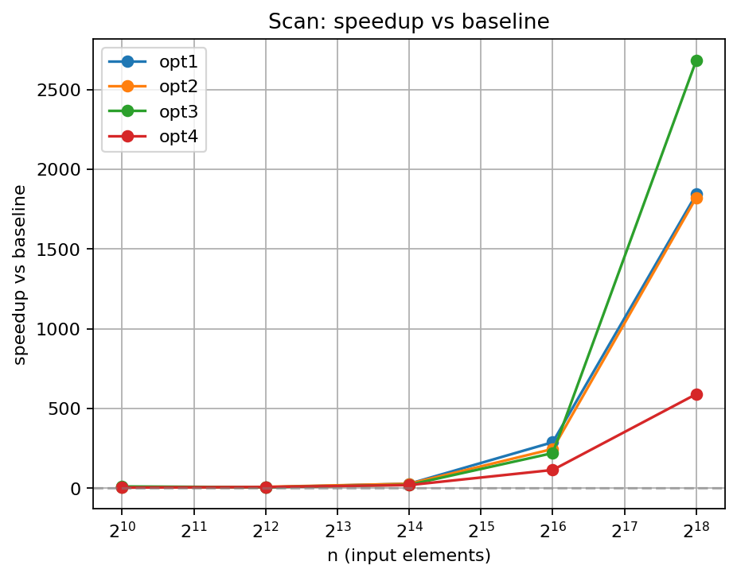

# Scan Benchmark Results

- Generated from: `/content/gpu-parallel-patterns/benchmarks/results/scan_20260329_150544.csv`

- Git revision: `044a4db`

- Environment capture: `/content/gpu-parallel-patterns/benchmarks/results/scan_20260329_150544_env.txt`

## Plots

### Time vs input size

### Speedup vs baseline

## Tables

> Notes:

> - `cpu_ref` is the single-threaded CPU reference (not a GPU variant).

> - Speedup is computed as `baseline_time / variant_time`.

> - If a row shows `—`, it usually means baseline timing is missing for that size.

**Avg time per iteration (ms)**

| n | cpu_ref | baseline | opt1 | opt2 | opt3 | opt4 |
|---|---|---|---|---|---|---|
| 1024 | 0.0013 | 0.0403 | 0.0113 | 0.0112 | 0.0039 | 0.0116 |
| 4096 | 0.0052 | 0.0893 | 0.0160 | 0.0114 | 0.0157 | 0.0126 |
| 16384 | 0.0214 | 0.3191 | 0.0116 | 0.0116 | 0.0154 | 0.0167 |
| 65536 | 0.0843 | 3.3402 | 0.0116 | 0.0136 | 0.0152 | 0.0293 |
| 262144 | 0.3482 | 48.3050 | 0.0262 | 0.0265 | 0.0180 | 0.0819 |
| 1048576 | 1.3487 | — | 0.0946 | 0.1117 | 0.0758 | 0.3236 |
| 4194304 | 5.7287 | — | 0.3719 | 0.4340 | 0.2934 | 1.2551 |
| 16777216 | 28.3656 | — | 1.4844 | 1.7238 | 1.1272 | 4.9833 |
| 67108864 | 88.7350 | — | 5.9058 | 6.8798 | 4.4808 | 19.8679 |
| 134217728 | 179.6990 | — | 11.8530 | 13.7630 | 8.9447 | 40.0023 |

**Speedup vs baseline**

| n | baseline | opt1 | opt2 | opt3 | opt4 |
|---|---|---|---|---|---|
| 1024 | 1.00x | 3.57x | 3.60x | 10.33x | 3.47x |
| 4096 | 1.00x | 5.58x | 7.83x | 5.69x | 7.09x |
| 16384 | 1.00x | 27.51x | 27.51x | 20.72x | 19.11x |
| 65536 | 1.00x | 287.95x | 245.60x | 219.75x | 114.00x |
| 262144 | 1.00x | 1843.70x | 1822.83x | 2683.61x | 589.80x |
