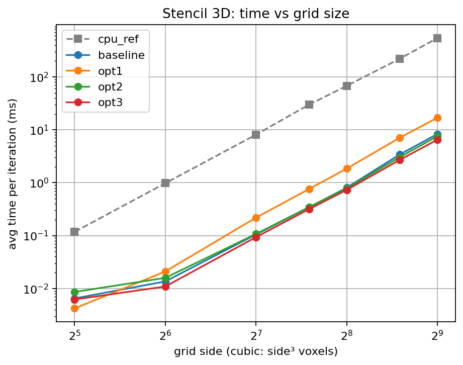
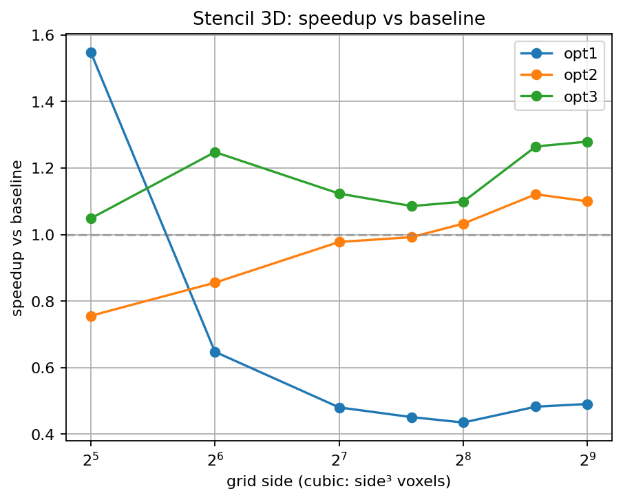

# Stencil 3D Benchmark Results

- Generated from: `/content/gpu-parallel-patterns/benchmarks/results/stencil_20260329_154135.csv`

- Git revision: `bf5a5a3`

- Environment capture: `/content/gpu-parallel-patterns/benchmarks/results/stencil_20260329_154135_env.txt`

## Plots

### Time vs grid size

### Speedup vs baseline

## Tables

> Notes:

> - 7-point 3D stencil (fixed weights, no radius parameter).

> - Grid is cubic: side × side × side voxels.

> - `cpu_ref` is the single-threaded CPU reference (not a GPU variant).

> - Speedup is computed as `baseline_time / variant_time`.

> - If a row shows `—`, it usually means baseline timing is missing for that size.

**Avg time per iteration (ms)**

| side | cpu_ref | baseline | opt1 | opt2 | opt3 |
|---|---|---|---|---|---|
| 32 | 0.1177 | 0.0065 | 0.0042 | 0.0086 | 0.0062 |
| 64 | 0.9797 | 0.0136 | 0.0210 | 0.0159 | 0.0109 |
| 128 | 8.0840 | 0.1050 | 0.2185 | 0.1074 | 0.0935 |
| 192 | 29.9560 | 0.3429 | 0.7598 | 0.3456 | 0.3159 |
| 256 | 67.6920 | 0.8030 | 1.8452 | 0.7776 | 0.7309 |
| 384 | 220.5340 | 3.4102 | 7.0640 | 3.0423 | 2.6965 |
| 512 | 540.5700 | 8.3114 | 16.9327 | 7.5570 | 6.4984 |

**Speedup vs baseline**

| side | baseline | opt1 | opt2 | opt3 |
|---|---|---|---|---|
| 32 | 1.00× | 1.55× | 0.76× | 1.05× |
| 64 | 1.00× | 0.65× | 0.86× | 1.25× |
| 128 | 1.00× | 0.48× | 0.98× | 1.12× |
| 192 | 1.00× | 0.45× | 0.99× | 1.09× |
| 256 | 1.00× | 0.44× | 1.03× | 1.10× |
| 384 | 1.00× | 0.48× | 1.12× | 1.26× |
| 512 | 1.00× | 0.49× | 1.10× | 1.28× |
